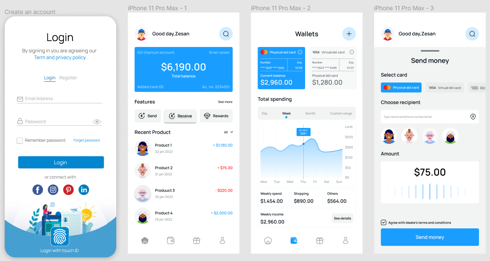

# Flutter App: Money Transfer App

### Description
Create simple app to complete test of Job using Flutter and API from [Dummy Data](https://test-api.afg-indo.com/)


### Using API
<br/>

#### To Get All Products

```http
  GET /api/products
```

#### Image Source

```http
  GET /storage/product_images/{image.jpg}
```
#### Login

```http
  GET /api/login
```

| Parameter | Type     |
| :-------- | :------- |
| `email` | `string` |
| `password` | `string` |

#### Register

```http
  POST /api/register
```

| Parameter | Type     |
| :-------- | :------- |
| `email` | `string` |
| `password` | `string` |
| `name` | `string` |


### Features
- Login with email and password
- Register
- Consume API
- Testing


### Package
- Google_fonts
- Mockito
- Build_runner
- Get
- Get_it
- Dio
- Responsive_Framework
- awesome_dialog
- freezed_annotation
- freezed
- json_annotation
- json_serializable

### Tech Used
 


## Screenshots


 

